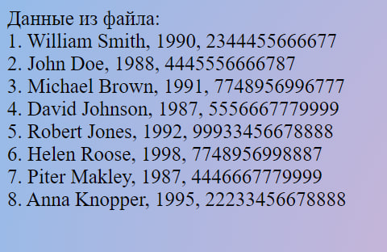
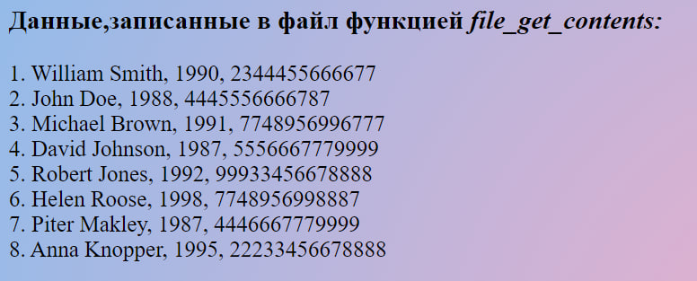
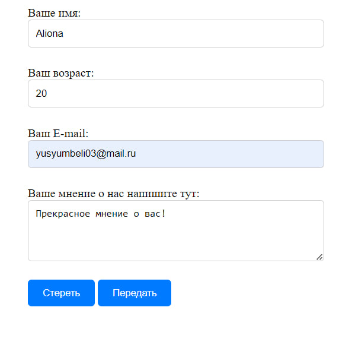
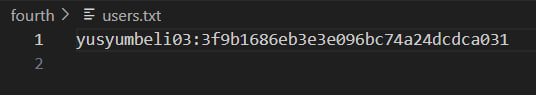

# Лабораторная работа № 5-6
## Тема:Обработка файлов и заголовки

### 1. Запись и чтение из файла
1.1. Проанализируйте следующий скрипт
1.2. Объясните, зачем необходимо закрывать файл `fclose()`
>`fclose()` в PHP следует использовать для закрытия файлов после их использования, чтобы освободить системные ресурсы и гарантировать сохранение изменений, обеспечивая тем самым безопасную и эффективную работу с файлами.

1.3. Добавьте в файл с помощью функции `fwrite()` ещё 3 записи
```php
fwrite($file, "6. Helen Roose, 1998, 7748956998887\n");
fwrite($file, "7. Piter Makley, 1987, 4446667779999\n");
fwrite($file, "8. Anna Knopper, 1995, 22233456678888\n");
```

## Screenshot
__Отображение записей__  
 

### 2. Запись в файл с помощью функции `file_get_contents()`
2.1. В задании №1 замените функцию `fwrite` на `file_put_contents()`
```php
<?php
$file = "file2.txt";
$current.="1. William Smith, 1990, 2344455666677\n";
$current.="2. John Doe, 1988, 4445556666787\n";
$current.="3. Michael Brown, 1991, 7748956996777\n";
$current.="4. David Johnson, 1987, 5556667779999\n";
$current.="5. Robert Jones, 1992, 99933456678888\n"; 

file_put_contents($file, $current);
$current="";
$current.="6. Helen Roose, 1998, 7748956998887\n";
$current.="7. Piter Makley, 1987, 4446667779999\n";
$current.="8. Anna Knopper, 1995, 22233456678888\n";
file_put_contents($file, $current, FILE_APPEND);
$current = file_get_contents($file);
?>
<div><h3>Данные,записанные в файл функцией <i>file_get_contents:</i></h3></div>
<?php
echo nl2br(file_get_contents($file));

```
2.2. Чем отличается функция `fwrite` и `file_put_contents`?
>`fwrite()` используется для записи данных в файл, требуя явного указания открытого файла с помощью `fopen()`.  
`file_put_contents()` - более простой способ записи данных в файл, так как она автоматически открывает и закрывает файл.  
 Обе функции позволяют записывать данные в файл, но `file_put_contents()` обычно более удобна для простых операций записи.
## Screenshot
__Такое же отображение__  
 


### 3. Обработка форм и файлов
3.1. Проанализируйте следующий скрипт
>Этот `PHP` код отображает `HTML` форму для ввода данных, а затем сохраняет введенные данные в файл и выводит их содержимое после отправки формы.  

3.2. Добавьте код, чтобы данные с формы сохранялись в файл
3.3. Добавьте еще 2 контроллера в форму и их верное сохранение в файл
- Возраст (age), типа number.
- E-mail, типа email.

## Screenshots
__Плюс два контроллера в форму(и немного стилей ;)__  
 
__Вывод из файла__
 

### 4. Регистрация и авторизация пользователей
4.1. Создайте HTML-форму регистрации с двумя полями: `login` (имя пользователя) и `password` (пароль).   

 


4.2. Напишите PHP-скрипт, который обрабатывает данные, отправленные с формы.  
4.3. Скрипт должен:  
- Проверить, что все поля заполнены.  
- Зашифровать пароль пользователя с помощью функции `md5()`.  
- Сохранить данные пользователя в текстовый файл (например, `users.txt`) в формате: `login:password`.  
4.4. При успешной регистрации отправьте пользователю HTTP-код 201 (Created).
Объясните, для чего используются `HTTP`-коды.  

__Сообщение об успещной регистрации__
 

__Данные на файле__
 


4.4. Создайте `HTML`-форму авторизации с двумя полями: `login` (имя пользователя) и `password` (пароль). 

 

4.5. Напишите `PHP`-скрипт, который обрабатывает данные, отправленные с формы.  
4.6. Скрипт должен:  
- Проверить, что все поля заполнены.  
- Проверить, существует ли пользователь с таким логином и паролем в файле
`users.txt`.  
- Если пользователь не найден, вывести сообщение об ошибке.  
- Если пользователь найден, перенаправить его на страницу с изображениями(например, `images.php`) с помощью функции `header()`.  

__Перенаправление на `images.php`__
  